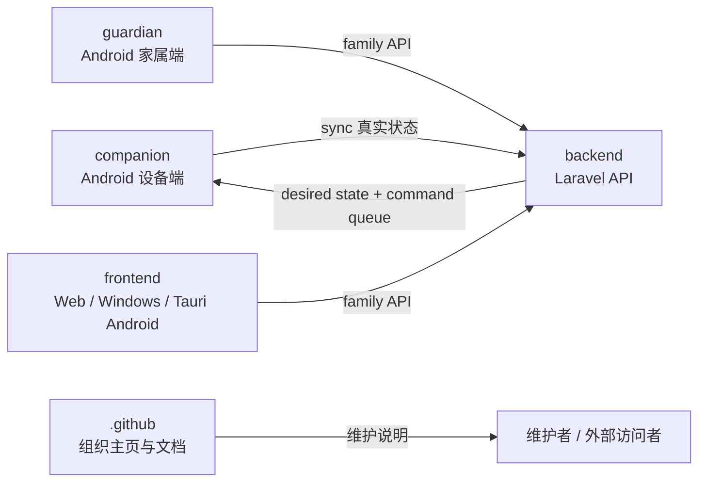
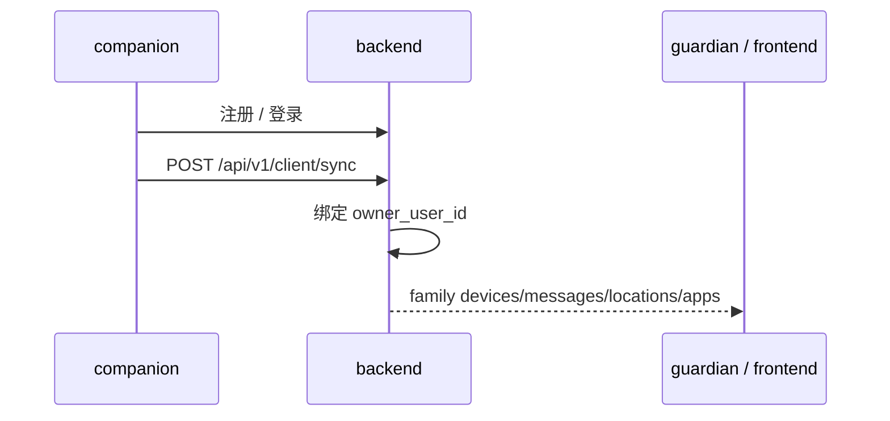
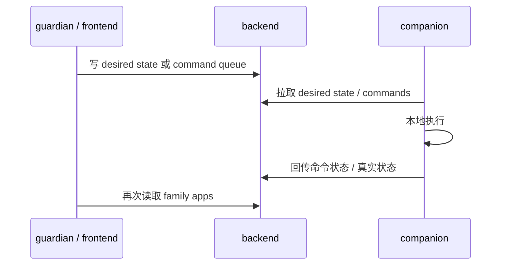
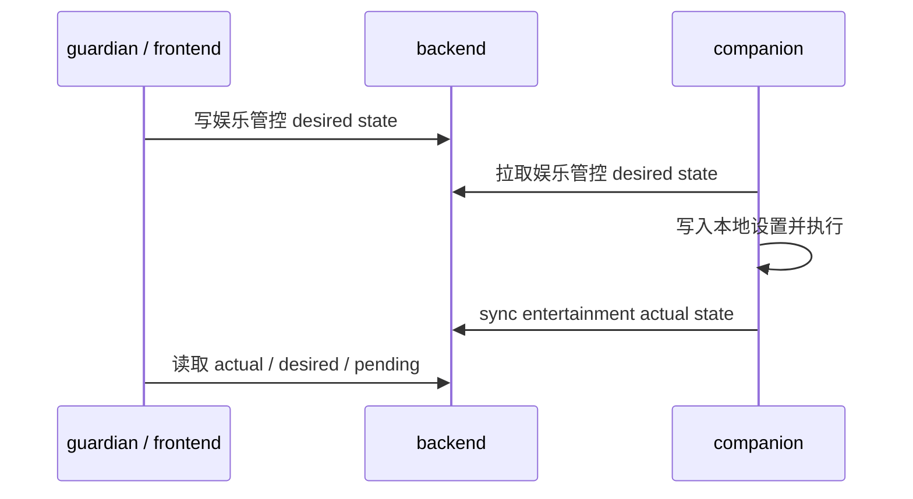
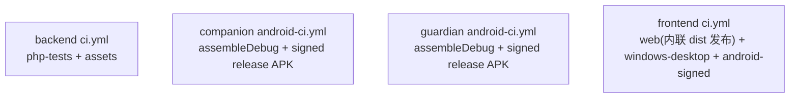

# SilverGuard 组织级 HLD

## 1. 系统上下文

## 2. 仓库边界

### 2.1 `backend`

- 账号鉴权
- 设备归属
- sync 收口
- family API
- 应用 / 娱乐管控云端状态

### 2.2 `companion`

- 设备端本地数据采集
- WorkManager 调度
- Device Admin / Dhizuku / Device Owner 能力检测
- 应用与娱乐管控实际执行

### 2.3 `guardian`

- 原生 Android 家属端
- family API 消费
- 设备切换、会话恢复、地图展示

### 2.4 `frontend`

- Vue 多端家属端
- family API 消费
- Web / Windows / Tauri Android 打包

### 2.5 `.github`

- 组织主页
- 维护总览
- 组织级 PRD/HLD/LLD/TDD

## 3. 关键业务流

### 3.1 同步链路

### 3.2 远程应用控制链路

### 3.3 娱乐管控链路

## 4. 认证与鉴权

### 4.1 当前模型

- companion 与 family 共用同一用户表
- 后端通过 token subject 区分 `companion` 与 `family`
- companion 同步接口额外要求 `X-Api-Key`

### 4.2 family 客户端

- `guardian`：OkHttp interceptor + authenticator
- `frontend`：fetch 封装 + 401 自动 refresh

## 5. 运行与交付形态

| 仓库 | 运行形态 | 当前交付物 |
| --- | --- | --- |
| `backend` | PHP API 服务 | 服务端代码与 Nginx 示例 |
| `companion` | Android 原生 | 签名 `release` APK |
| `guardian` | Android 原生 | 签名 `release` APK |
| `frontend` | Web / Windows / Android | `dist/`、`.msi`、`.exe`、Android `release` APK |

## 6. CI 拓扑

## 7. 当前技术事实

- `backend`：Laravel 13 / PHP 8.4
- `companion`：Kotlin 2.3.20 + Compose + Hilt + Room + WorkManager 2.11.2 + Retrofit 3 + OkHttp 5
- `guardian`：Kotlin 2.3.20 + Compose + Hilt + Retrofit 3 + OkHttp 5 + DataStore
- `frontend`：Vue 3 + Vue Router 5 + TypeScript 6 + Vite 8 + Tauri 2

## 8. 架构约束

- 同账号设备归属必须由后端统一收口
- family API 语义必须在 `guardian` 与 `frontend` 间保持一致
- 设备端真实状态与云端期望状态不能混成单一字段
- `frontend` 必须保持 Hash 路由与 `base: './'`

## 9. 待确认

- companion 本地模块中哪些会进入跨仓主线
- 各仓库待确认配置项的长期归属
