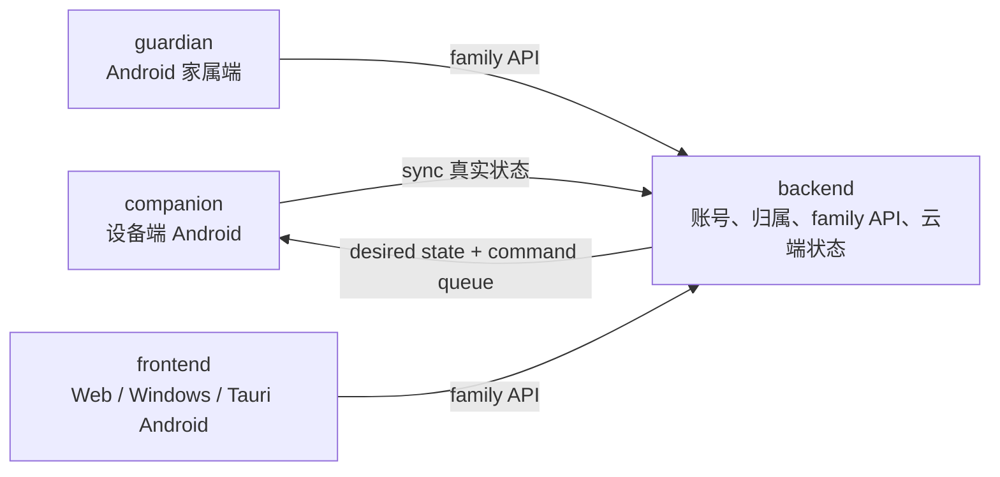

# 银龄守望（SilverGuard）

SilverGuard 是一套围绕“设备端真实状态采集 + 云端状态中枢 + 家属端远程查看与管理”构建的多仓库系统。

它当前由 4 个业务仓库组成：

- `companion`：Android 设备端
- `backend`：Laravel 服务端中枢
- `guardian`：Android 家属端
- `frontend`：Web / Windows / Tauri Android 家属端

## 核心问题

SilverGuard 当前重点解决三件事：

- 家属端只能看到同账号设备，而不是公开设备
- 远程控制要区分云端期望状态与设备真实状态
- 家属端需要同时覆盖 Android、Web、Windows 等多种使用场景

## 当前架构

## 当前已打通的主线

- companion 登录、同步并认领设备
- backend 按 `owner_user_id` 做设备归属隔离
- guardian / frontend 使用同账号登录后查看设备
- 应用停用 / 启用 / 时长限制的云端期望状态
- 应用安装 / 卸载命令队列
- 娱乐管控 actual / desired / pending

## 仓库矩阵

| 仓库 | 当前职责 | 主要技术栈 |
| --- | --- | --- |
| `backend` | 鉴权、设备归属、sync、family API、应用与娱乐管控云端状态 | Laravel 13、PHP 8.4 |
| `companion` | 本地采集、自动同步、设备保护、应用与娱乐管控执行 | Kotlin 2.3.20、Compose、Hilt、Room、WorkManager 2.11.2、Retrofit 3、OkHttp 5 |
| `guardian` | Android 家属端设备查看与远程管理 | Kotlin 2.3.20、Compose、Retrofit 3、OkHttp 5、DataStore |
| `frontend` | 多端家属端前端与打包 | Vue 3、Vue Router 5、TypeScript 6、Vite 8、Tauri 2 |

## 当前产品事实

- 设备归属当前由后端 `devices.owner_user_id` 决定
- companion 与 family 当前共用同一账号表，不是两套账号体系
- 应用管理当前采用双模型：
  - `INSTALL` / `UNINSTALL`：命令队列
  - `ENABLE` / `DISABLE` / `SET_LIMIT`：云端期望状态
- 设备能力当前明确区分 `none / admin / dhizuku / owner`

## 技术与交付

- `backend`：独立 API 服务
- `companion`：Android release APK
- `guardian`：Android release APK
- `frontend`：Web dist、Windows `.msi/.exe`、Android release APK
- 所有业务仓库当前都接入了 GitHub Actions

## 当前边界说明

`companion` 里还能看到陪伴、健康、跌倒、报告等本地模块，但并不是所有本地能力都已经进入家属端主线。组织级对外说明应以当前已打通的“设备 / 消息 / 位置 / 应用 / 娱乐管控”主线为准。

## 文档入口

- 维护说明：[`README.md`](../README.md)
- 组织级设计文档：[`docs/`](../docs)
