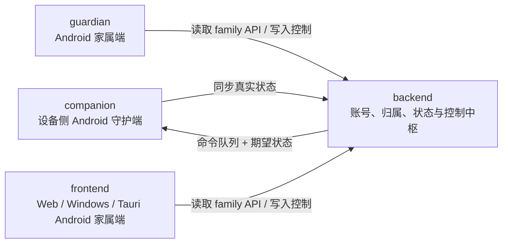

# SilverGuard

SilverGuard 是一个围绕“被守护设备 + 家属端协作 + 云端状态中枢”构建的多仓库系统。

它不是单一 App，而是一组协同工作的产品：

- 一个安装在设备上的 Android 守护端
- 一个 Android 家属端
- 一个 Web / Windows / Android 多端家属端
- 一个负责账号、归属、同步与远程控制的后端

## 这个项目想解决什么问题

SilverGuard 主要面向这些真实需求：

- 家属想远程查看同账号下设备的关键状态，而不是谁知道设备 ID 谁都能看
- 远程控制应用时，不能只记录“发过命令”，还要知道“设备实际有没有落地”
- 家属端不应该只有一个平台，需要同时支持 Android、Web、Windows 等不同使用场景
- 设备守护能力不是非黑即白，而是要区分普通状态、设备管理员、Dhizuku API、设备所有者这些不同能力层级
- 设备侧采集、云端状态存储、家属端展示这三层逻辑，需要被拆开并稳定协作

## 4 个仓库如何协作

协作关系可以概括成一句话：

- `companion` 负责“真实设备状态和本地执行”
- `backend` 负责“账号、归属、同步收口和控制模型”
- `guardian` 与 `frontend` 负责“家属端查看与远程管理”

## 核心产品目标

### 1. 同账号设备归属

设备不是公开资源，而是绑定到账号。

- 设备侧登录并同步后，设备归属到当前账号
- 家属端登录后，只能看到同账号设备
- 后端负责阻止不同账号抢占同一台设备

### 2. 云端期望状态和设备真实状态并存

SilverGuard 没有把所有操作都做成简单命令队列，而是把应用控制拆成两类：

- `INSTALL`、`UNINSTALL`：一次性动作，走命令队列
- `ENABLE`、`DISABLE`、`SET_LIMIT`：持续性动作，走期望状态模型

这样系统能明确区分：

- 云端希望设备变成什么状态
- 设备当前实际上报的是什么状态
- 是否还在等待下一次同步落地

### 3. 多端家属端统一体验

家属侧不是只做一个平台，而是提供两条产品线：

- `guardian`：原生 Android 家属端
- `frontend`：Web / Windows / Tauri Android 多端家属端

两者共享同一套 family API 和同一套业务边界。

## 仓库关系与职责

| 仓库 | 角色 | 主要职责 | 主要技术栈 |
| --- | --- | --- | --- |
| [backend](https://github.com/SLU-SilverGuard/backend) | 服务端中枢 | 账号鉴权、设备归属、同步写入、family 读模型、应用控制状态 | Laravel 12, PHP 8.4, PHPUnit |
| [companion](https://github.com/SLU-SilverGuard/companion) | 设备侧 Android 守护端 | 本地采集、自动同步、设备保护、应用控制执行 | Kotlin, Jetpack Compose, Hilt, Room, WorkManager, Retrofit, OkHttp, DataStore |
| [guardian](https://github.com/SLU-SilverGuard/guardian) | Android 家属端 | 同账号设备查看、消息/位置/应用管理、远程控制 | Kotlin, Jetpack Compose, Hilt, Retrofit, OkHttp, DataStore, AMap SDK |
| [frontend](https://github.com/SLU-SilverGuard/frontend) | 多端家属端 | Web/Windows/Android 家属端统一前端、设备与应用管理 | Vue 3, TypeScript, Vite 7, Vue Router 4, Tauri 2 |

## 已实现的能力

### 设备侧

- 伴端账号注册、登录、token 刷新
- 默认自动同步、调试模式手动同步、实时同步开关
- 上报短信、位置、应用列表、应用使用记录、设备权限状态
- 执行远程应用启用、停用、限时、安装、卸载
- 设备保护能力引导与状态展示：Device Admin、Dhizuku API、Device Owner

### 家属侧

- 同账号登录
- 设备列表与设备切换
- 设备概览
- 消息查看
- 位置历史与地图展示
- 应用状态查看与远程管理
- 设备能力状态显示

### 云端

- 多用户设备归属隔离
- family API 读模型
- companion 同步写入接口
- 应用期望状态模型
- 应用命令队列与状态回传

## 技术栈总览

### 后端

- Laravel 12
- PHP 8.4
- PHPUnit
- SQLite / PostgreSQL 兼容开发

### Android 端

- Kotlin
- Jetpack Compose
- Hilt
- Room
- WorkManager
- Retrofit
- OkHttp
- DataStore
- AMap SDK

### 前端与桌面端

- Vue 3
- TypeScript 5
- Vite 7
- Vue Router 4
- Tauri 2

### 工程与交付

- GitHub Actions
- Gradle 9.4.0
- Android Gradle Plugin 9.1.0
- JDK 21
- 多仓库独立发版
- 签名 APK / Windows 安装包自动构建与上传

## 技术亮点

### 1. 多仓库但单业务模型

虽然项目拆成 4 个仓库，但核心业务边界是一致的：

- 同账号设备归属
- family 读模型
- 应用双模型控制

这让 Android 家属端和 Web / Tauri 家属端可以共用同一套后端语义。

### 2. 期望状态 + 真实状态双轨同步

这是整个系统最重要的设计之一。

它比“只下发命令”更适合远程家属控制场景，因为它可以自然表达：

- 云端已经要求停用
- 设备尚未同步
- 设备已实际停用

### 3. 分层设备控制能力

SilverGuard 没有把设备保护抽象成单一“已激活”布尔值，而是明确区分：

- 普通状态
- 设备管理员
- Dhizuku API
- 设备所有者

这让家属端看到的状态和设备侧实际可执行能力保持一致。

### 4. 原生 Android 与跨端 Tauri 并行

项目没有在“只做原生”或“只做 Web 包壳”之间二选一，而是同时采用：

- 原生 Android 守护端
- 原生 Android 家属端
- Vue + Tauri 多端家属端

这样既保留设备侧强控制能力，也保留家属侧多平台覆盖能力。

## 前沿技术与框架

这个项目里用到的、相对更有代表性的技术包括：

- **Jetpack Compose**：Android 现代声明式 UI 框架
- **Tauri 2**：用于构建 Windows / Android 家属端容器的跨端桌面与移动方案
- **Dhizuku API**：在非 Device Owner 条件下扩展设备管理能力的 Android 生态方案
- **WorkManager**：设备侧稳定后台同步调度
- **Hilt**：Android 依赖注入框架
- **Room**：Android 本地结构化存储
- **Laravel 12**：后端 API 与业务中枢框架
- **Vite 7 + Vue 3**：现代前端开发与构建链
- **GitHub Actions Raw Artifact Uploads**：签名 APK / Windows 安装包直接文件交付

此外，`companion` 还集成了面向 AI 能力扩展的接口配置，例如：

- GLM 相关能力
- 讯飞语音相关能力

这些能力让项目不仅是“远程管理工具”，也保留了向陪伴、报告、语音交互等方向扩展的空间。

## 为什么拆成 4 个仓库

因为这 4 个部分的生命周期、发布频率和运行环境都不同：

- 后端需要独立部署与演进
- 设备侧守护端需要以 Android 原生能力为中心
- Android 家属端需要保持原生体验
- Web / Windows / Tauri 家属端需要独立迭代前端与打包流程

拆仓后可以做到：

- 各自独立发版
- 各自独立 CI
- 各自独立签名与交付
- 业务协作关系仍然清晰

## 开发原则

- 设备归属优先于“调试方便”
- 接口兼容优先于“局部重构美观”
- 家属端展示要尽量忠实反映设备真实状态
- 文档、CI、签名和版本号必须保持同步
